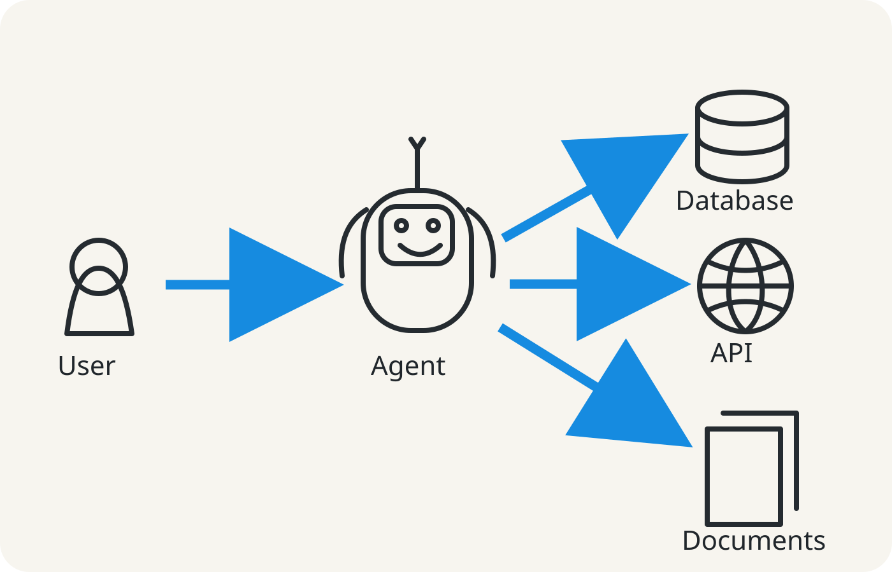

<div align="center">
  

# Kopano Labs · Public Systems Studio

**Observed implementation and deployment source for [KopanoLabs.com](https://kopanolabs.com) — experiments, sovereign systems, Cars4Mars engineering evidence and adaptive public interfaces built from South Africa. Canonical GitHub production-source authority remains owner-gated until explicitly established.**

[](https://kopanolabs.com)
[](https://github.com/RobynAwesome/Kopano-Labs-Website)
[](https://kopanolabs.com/Cars4Mars/)

</div>

> **Source governance:** `RobynAwesome/Kopano-Labs-Website` is the currently observed GitHub implementation/deployment repository for KopanoLabs.com. `canonical_source_repository` remains `null` until explicit owner establishment. `Kopano-Labs/Introduction-to-MCP` remains the Main Brain governance/architecture authority and is not a runtime dependency.

---

## Mission

Kopano Labs is not a flat portfolio. The public surface is an **adaptive progressive system**: a visitor states what they need, the interface routes them into the right depth, and the same route registry guides search crawlers, humans and CI.

```text
Intent
  ↓
Adaptive route registry
  ├── Human interface
  ├── sitemap.xml
  ├── robots.txt
  └── CI production gates
        ↓
Labs · Systems · Content · Cars4Mars · FOC · Proof
```



---

## Cars4Mars mission control

Cars4Mars is now treated as a **living build surface**, not a report wrapper.

Current public modules:

- mission state: `DESIGNED → FUNDED → ORDERED → ASSEMBLED → TESTED`;
- next physical gate with explicit acceptance evidence;
- open build ledger recording verified transitions;
- rover architecture and safety-authority map;
- media control linking live, upload and channel lanes on `@kopanolabs`;
- support lanes for equipment, funding, engineering, facilities, media and education;
- official Cars4Mars acknowledgement.

The design submission was completed on **02 August 2026**. The submitted package is **not** a website dependency or public release gate. Production must not regenerate, reconstruct or block on `/reports/KOPANO_LABS.pdf` unless that policy is explicitly changed.


---

## Runtime stack

<div align="center">


</div>

---

## Public experience map

| Route | Purpose | State |
|---|---|---|
| `/` | Adaptive public entry + spatial Kopano systems map | **Implemented** |
| `/systems/` | Operational systems registry | **Implemented / evolving** |
| `/labs/` | Experiment discovery and focused entry | **Implemented / evolving** |
| `/content/` | Public estate / connected project surface | **Implemented / evolving** |
| `/Cars4Mars/` | Rover mission control, ledger, architecture, media and support | **Implemented / evidence expanding** |
| `/FOC/` | POC/FOC classification and product-state surface | **Implemented / evolving** |
| `/proof/` | Source lineage, claims and public build state | **Implemented** |
| `/sitemap.xml` | Generated crawler discovery map | **Implemented** |
| `/robots.txt` | Guided crawler policy, not a blanket block | **Implemented** |
| `/release.json` | Machine-readable production and evidence state | **Implemented** |
